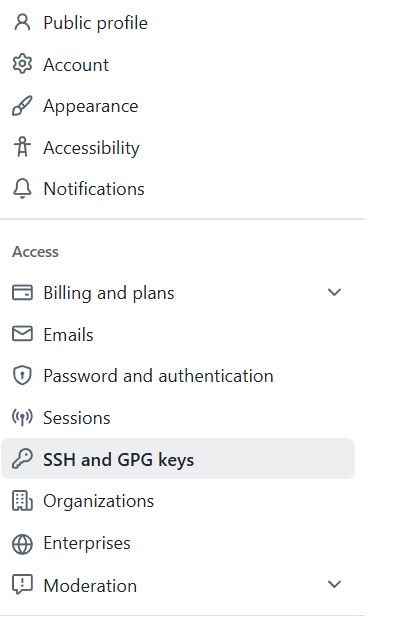
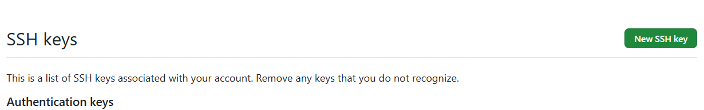
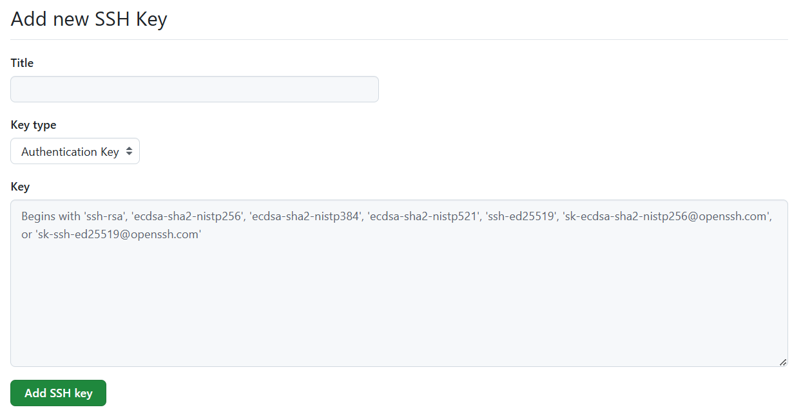

# For Windows Users
以下の事前準備をお願いします．
- [ ] WSL2の準備
- [ ] Githubアカウントの作成
- [ ] Githubアカウントとwsl2のSSH接続
- [ ] Docker Desktopのインストール
- [ ] VSCodeの設定 

## WSL2の準備
WSL2（Windows Subsystem For Linux）は，Windows上でLinuxを動かすことのできるソフトウェアです．本講習では，WSL2の利用を前提としています．
まず，Microsoft Store から，Windows Terminal をダウンロードしてください．

続いて，Microsoft Storeで Ubuntu をダウンロードしてください．もし，すでに WSL2 で Ubuntu を使用しているという場合は，Ubuntu 24.04.1 LTS を使用しても構いません．

インストール後， "開く" を押下します．

起動後，ターミナルが開き，Ubuntu が起動します．数分間の待機後，Username と Password の設定を求められます．

~~~bash
Enter new UNIX username:
New password:
~~~

パスワードの設定後，以下の表示が確認でき，入力を受け付けるようになれば完了です．

~~~bash
username@DESKTOP-id:~$
~~~

## Github アカウントの作成
git は，ソースコードのバージョン管理ソフトウェアであり，ソースコードの変更履歴を残すことができます．また，Github を使用することで，自分のソースコードを他のユーザと共有したり，共同で同じソースコードを修正したりすることができます．研究において作成したソースコードは，全てバージョン管理を行うことを強く推奨します．

[Github のホームページ](https://github.co.jp/ "Github のホームページ")の右上にある Sign up を押下し，アカウントを作成してください．すでにアカウントを所持している場合は必要ありません．使用するメールアドレスは自由ですが，大学のメールアドレス（ドメインが`??.ritsumei.ac.jp`）を使用すると学生の認証ができ，有料機能の一部を無料で使用することができます．

Github アカウントを確認するために，[本レポジトリのアカウント登録用ページ](https://github.com/IkuRiriri/Spring_Introduction_2025/issues/1 "本レポジトリのアカウント登録用ページ")に飛び，指示の通りの登録をお願いします．なお，使用したメールアドレスが大学のもの（ドメインが`??.ritsumei.ac.jp`），もしくは研究室のもの（`name.aislab@gmail.com`）である場合はメールアドレスのみで十分です．

## Githubアカウントとwsl2のSSH接続

先程セットアップした Ubuntu と，Github アカウントで SSH 接続を行います．SSH とは，Secure SHell の略称で，これを使用することで暗号化された安全な通信を行うことができます．今回は，公開鍵暗号を使用します．
なお，既にアカウントを SSH 接続している場合は必要ありません．

始めに，Ubuntu 上の git に対し，username と メールアドレスの設定を行います．Github アカウントと同じものを使用することを推奨します．

~~~bash
$ git config --global user.name [任意のusername]
$ git config --global user.email [任意のメールアドレス]
~~~

続いて，公開鍵暗号を作成します．一般的に ssh 鍵は，ホームディレクトリ直下に保管することが慣習であるため，本講習においてもそれに習います．秘密鍵に対するパスワードの設定を求められるため，設定してください．

~~~bash
$ ssh-keygen -t ed25519 -C "[任意のメールアドレス]" -f ~/.ssh/github
~~~

続いて，公開鍵を Github アカウントへと登録します．以下のコマンドで出力される公開鍵をコピーします．

~~~bash
$ cat ~/.ssh/github.pub
~~~
ログインした状態で[Github のホームページ](https://github.com/ "Github のホームページ")にアクセスし，右上のユーザアイコンを押下し，Settings > SSH and GPG keys > New SSH key を選択します．

Title に接続先の識別名（ex: Ubuntu），Key に先ほどコピーした公開鍵を入力し，Add SSH key で登録します．

