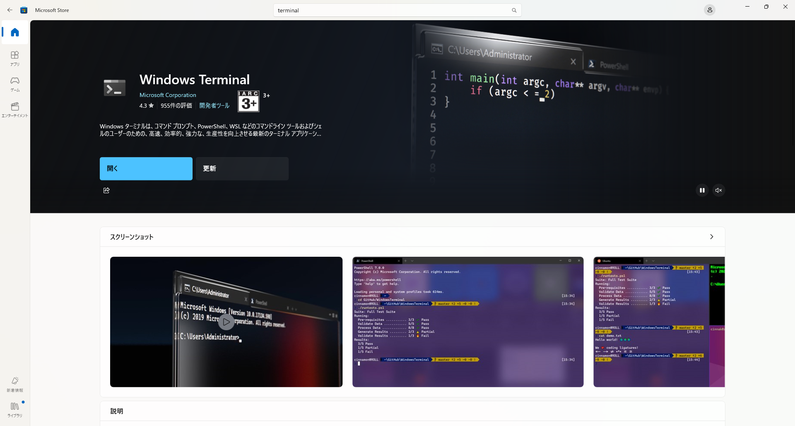
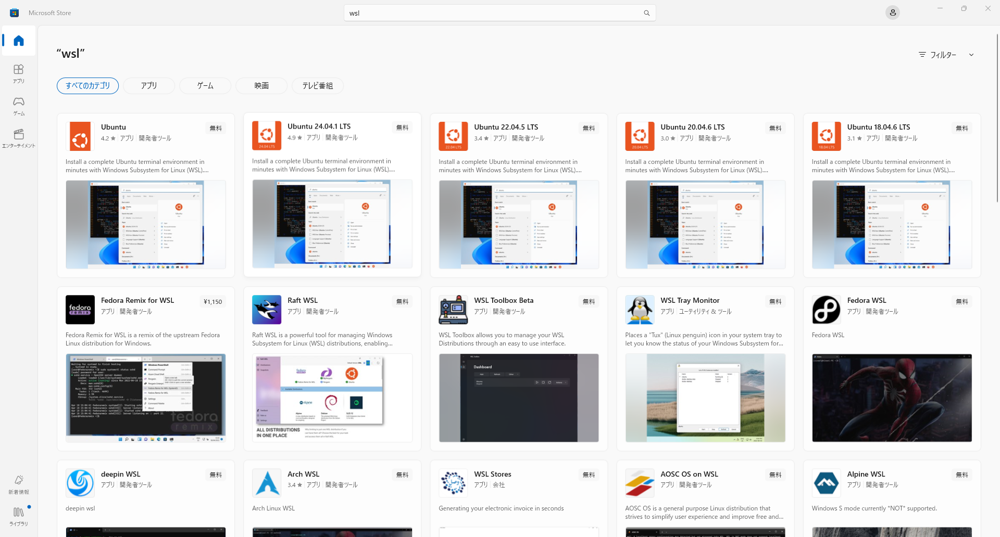
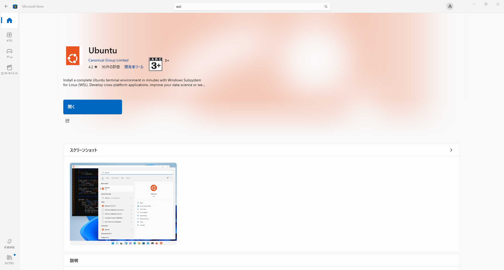

# For Windows Users
以下の事前準備をお願いします．
- [ ] WSL2の準備
- [ ] Githubアカウントの作成
- [ ] Githubアカウントとwsl2のSSH接続
- [ ] Docker Desktopのインストール
- [ ] VSCodeの設定 

## WSL2の準備
WSL2（Windows Subsystem For Linux）は，Windows上でLinuxを動かすことのできるソフトウェアです．本講習では，WSL2の利用を前提としています．
まず，Microsoft Store から，Windows Terminal をダウンロードしてください．

続いて，Microsoft Storeで Ubuntu をダウンロードしてください．もし，すでに WSL2 で Ubuntu を使用しているという場合は，Ubuntu 24.04.1 LTS を使用しても構いません．

インストール後， "開く" を押下します．

起動後，ターミナルが開き，Ubuntu が起動します．数分間の待機後，Username と Password の設定を求められます．

~~~bash
Enter new UNIX username:
New password:
~~~

パスワードの設定後，以下の表示が確認でき，入力を受け付けるようになれば完了です．

~~~bash
username@DESKTOP-id:~$
~~~

## Github アカウントの作成
git は，ソースコードのバージョン管理ソフトウェアであり，ソースコードの変更履歴を残すことができます．また，Github を使用することで，自分のソースコードを他のユーザと共有したり，共同で同じソースコードを修正したりすることができます．研究において作成したソースコードは，全てバージョン管理を行うことを強く推奨します．

[Github のホームページ](https://github.co.jp/ "Github のホームページ")の右上にある Sign up を押下し，アカウントを作成してください．すでにアカウントを所持している場合は必要ありません．使用するメールアドレスは自由ですが，大学のメールアドレス（ドメインが`??.ritsumei.ac.jp`）を使用すると学生の認証ができ，一部の機能を無料で使用することができます．

Github アカウントを確認するために，[本レポジトリのアカウント登録用ページ](https://github.com/IkuRiriri/Spring_Introduction_2025/issues/1 "本レポジトリのアカウント登録用ページ")に飛び，指示の通りの登録をお願いします．なお，使用したメールアドレスが大学のもの（ドメインが`??.ritsumei.ac.jp`），もしくは研究室のもの（`name.aislab@gmail.com`）である場合はメールアドレスのみで十分です．

## Githubアカウントとwsl2のSSH接続

